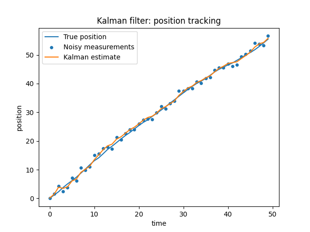
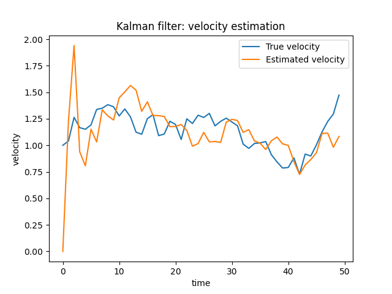

# Kalman Filter for Linear Gaussian State-Space Models

This repository contains my seminar materials and a simple implementation of the Kalman filter for linear Gaussian state-space models.

The project focuses on the main mathematical idea behind the Kalman filter: it is the closed-form solution of the Bayesian filtering equations when the model is linear and Gaussian.

## Overview

The Kalman filter is used to estimate a hidden state from noisy observations.

In a linear Gaussian state-space model, the state equation and observation equation are

$$
x_k = A_{k-1}x_{k-1} + q_{k-1}
$$

$$
y_k = H_kx_k + r_k
$$

where $q_{k-1}$ is process noise and $r_k$ is measurement noise.

We assume

$$
q_{k-1} \sim \mathcal{N}(0,Q_{k-1})
$$

$$
r_k \sim \mathcal{N}(0,R_k)
$$

The goal is to estimate the hidden state $x_k$ using all observations up to time $k$:

$$
p(x_k \mid y_{1:k})
$$

For linear Gaussian models, this distribution remains Gaussian. Therefore, instead of updating the whole probability distribution, the Kalman filter only updates the mean and covariance.

## Main Topics

This project covers:

- Linear Gaussian state-space models
- Bayesian filtering equations
- Prediction and update steps
- Closed-form Gaussian filtering distributions
- Kalman gain and its intuition
- Orthogonal projection interpretation
- A toy example for tracking position and velocity

## Bayesian Filtering View

The general Bayesian filtering recursion updates probability distributions:

$$
p(x_{k-1} \mid y_{1:k-1})
\longrightarrow
p(x_k \mid y_{1:k-1})
\longrightarrow
p(x_k \mid y_{1:k})
$$

The first step is the prediction step. It uses the dynamic model to propagate the previous filtering distribution forward.

The second step is the update step. It uses Bayes' rule to combine the predicted distribution with the new observation $y_k$.

In general, these distribution updates can be difficult to compute. However, in the linear Gaussian case, all relevant distributions remain Gaussian.

## Kalman Filter Recursion

Assume that after observing $y_{1:k-1}$, the previous filtering distribution is

$$
p(x_{k-1} \mid y_{1:k-1})=
\mathcal{N}(x_{k-1} \mid m_{k-1},P_{k-1})
$$

### Prediction Step

The predicted mean and covariance are

$$
m_k^- = A_{k-1}m_{k-1}
$$

$$
P_k^- = A_{k-1}P_{k-1}A_{k-1}^T + Q_{k-1}
$$

This gives the predicted distribution

$$
p(x_k \mid y_{1:k-1})=
\mathcal{N}(x_k \mid m_k^-,P_k^-)
$$

### Update Step

After observing $y_k$, define the innovation

$$
v_k = y_k - H_km_k^-
$$

The innovation measures the difference between the actual measurement and the predicted measurement.

The innovation covariance is

$$
S_k = H_kP_k^-H_k^T + R_k
$$

The Kalman gain is

$$
K_k = P_k^-H_k^TS_k^{-1}
$$

The updated mean and covariance are

$$
m_k = m_k^- + K_kv_k
$$

$$
P_k = P_k^- - K_kS_kK_k^T
$$

This gives the filtering posterior

$$
p(x_k \mid y_{1:k})=
\mathcal{N}(x_k \mid m_k,P_k)
$$

## Intuition Behind the Kalman Gain

The Kalman gain controls how much the filter trusts the new observation compared with the model prediction.

If the measurement noise covariance $R_k$ is large, the observation is noisy. Then the Kalman gain becomes smaller, so the filter trusts the model prediction more.

If the predicted covariance $P_k^-$ is large, the prediction is uncertain. Then the Kalman gain becomes larger, so the filter trusts the measurement more.

In short, the Kalman filter balances model prediction and noisy data.

## Toy Example: Tracking Position and Velocity

A simple example is tracking the position and velocity of an object moving in one dimension.

The hidden state is

$$
x_k =
\begin{pmatrix}
p_k \\
u_k
\end{pmatrix}
$$

where $p_k$ is position and $u_k$ is velocity.

Assume constant velocity motion with time step $\Delta t$:

$$
p_k = p_{k-1} + \Delta t\,u_{k-1}
$$

$$
u_k = u_{k-1}
$$

In matrix form,

$$
x_k = Ax_{k-1} + q_{k-1}
$$

where

$$
A =
\begin{pmatrix}
1 & \Delta t \\
0 & 1
\end{pmatrix}
$$

Suppose we only observe position. Then the measurement model is

$$
y_k = Hx_k + r_k
$$

where

$$
H =
\begin{pmatrix}
1 & 0
\end{pmatrix}
$$

Thus,

$$
y_k = p_k + r_k
$$

This example shows an important feature of the Kalman filter: even if we only observe position directly, the filter can still estimate velocity through the dynamic model.

## Example Results

The following plots show the performance of the Kalman filter on a simulated one-dimensional tracking problem.

### Position Tracking

The Kalman filter uses noisy position measurements to estimate the true hidden position.

### Velocity Estimation

Although only the position is observed, the Kalman filter also estimates the hidden velocity.

